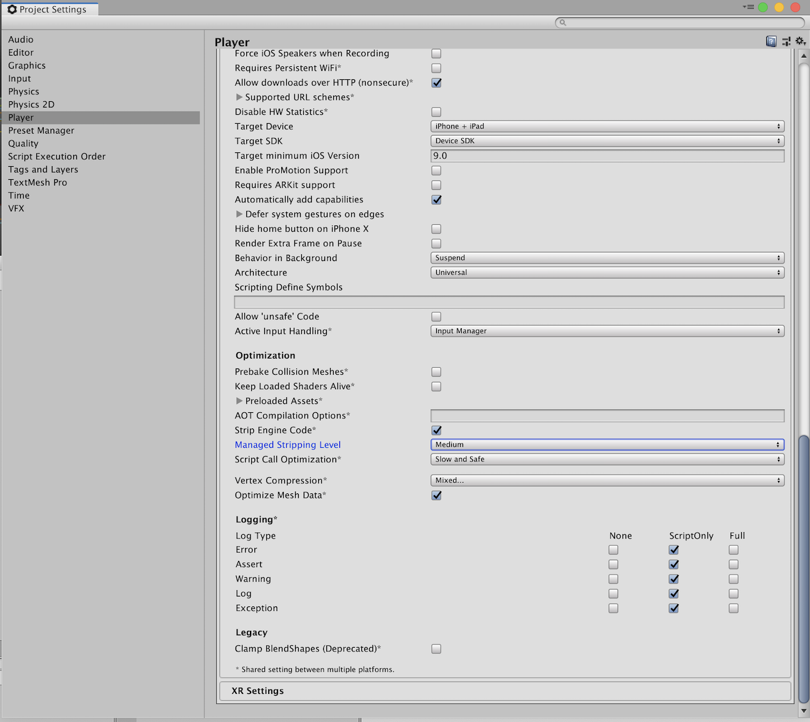

# Purpose
This package is intended for situations where you want Linq functionality in situations where it's undesirable to create garbage (i.e. during gameplay).

# Usage
* Unity
  * Add `"com.github.legocylon.relinq": "https://github.com/LegoCylon/Relinq.git",` to the manifest.json file in your project's Packages folder.
  * After Unity imports the package, it will add a lock section with the package name (`com.github.legocylon.relinq`) pinning you to the latest master commit SHA for the package on github. If you want to update to a newer version, delete the lock section for this package or manually update the SHA to the version you want to use.
  * Note: If IL2CPP is enabled for your project, you'll want to set the managed code stripping level to Medium or higher since IL2CPP pessimistically generates every permutation of all generic value types (which can quickly get out of control). A higher level of stripping will limit the [generic sharing](https://blogs.unity3d.com/2015/06/16/il2cpp-internals-generic-sharing-implementation/) permutations to what you're actually using.
  * 
* C#
  * Add `using Relinq;` to each file you want to be able to use one of the methods above.
  * At each callsite that you prefer to use Relinq rather than Linq, call `.AsEnumerable()` to convert enumerables into `EnumerableAdapter<TEnumerator, TSource>` instances. It's intentional that the name `AsEnumerable` conflicts with another Linq method of the same name - to help reinforce that mixing calls to both libraries is going to result in heap allocations when Linq is used by mistake.

Avoid explicitly referencing algorithm-specific enumerators where possible. They would be internal if it wasn't necessary for them to be instantiated at the callsite.

# Supported Linq-like Algorithms
* [Aggregate](https://docs.microsoft.com/en-us/dotnet/api/system.linq.enumerable.aggregate?view=netframework-4.7.2)
* [All](https://docs.microsoft.com/en-us/dotnet/api/system.linq.enumerable.all?view=netframework-4.7.2)
* [Any](https://docs.microsoft.com/en-us/dotnet/api/system.linq.enumerable.any?view=netframework-4.7.2)
* [Append](https://docs.microsoft.com/en-us/dotnet/api/system.linq.enumerable.append?view=netframework-4.7.2)
* [Cast](https://docs.microsoft.com/en-us/dotnet/api/system.linq.enumerable.cast?view=netframework-4.7.2)
* [Concat](https://docs.microsoft.com/en-us/dotnet/api/system.linq.enumerable.concat?view=netframework-4.7.2)
* [Contains](https://docs.microsoft.com/en-us/dotnet/api/system.linq.enumerable.contains?view=netframework-4.7.2)
* [Count](https://docs.microsoft.com/en-us/dotnet/api/system.linq.enumerable.count?view=netframework-4.7.2)
* [DefaultIfEmpty](https://docs.microsoft.com/en-us/dotnet/api/system.linq.enumerable.defaultifempty?view=netframework-4.7.2)
* [ElementAt](https://docs.microsoft.com/en-us/dotnet/api/system.linq.enumerable.elementat?view=netframework-4.7.2)
* [ElementAtOrDefault](https://docs.microsoft.com/en-us/dotnet/api/system.linq.enumerable.elementatordefault?view=netframework-4.7.2)
* [Empty](https://docs.microsoft.com/en-us/dotnet/api/system.linq.enumerable.empty?view=netframework-4.7.2)
* [First](https://docs.microsoft.com/en-us/dotnet/api/system.linq.enumerable.first?view=netframework-4.7.2)
* [FirstOrDefault](https://docs.microsoft.com/en-us/dotnet/api/system.linq.enumerable.firstordefault?view=netframework-4.7.2)
* [Last](https://docs.microsoft.com/en-us/dotnet/api/system.linq.enumerable.last?view=netframework-4.7.2)
* [LastOrDefault](https://docs.microsoft.com/en-us/dotnet/api/system.linq.enumerable.lastordefault?view=netframework-4.7.2)
* [Max](https://docs.microsoft.com/en-us/dotnet/api/system.linq.enumerable.max?view=netframework-4.7.2)
* [Min](https://docs.microsoft.com/en-us/dotnet/api/system.linq.enumerable.min?view=netframework-4.7.2)
* [OfType](https://docs.microsoft.com/en-us/dotnet/api/system.linq.enumerable.oftype?view=netframework-4.7.2)
* [Prepend](https://docs.microsoft.com/en-us/dotnet/api/system.linq.enumerable.prepend?view=netframework-4.7.2)
* [Range](https://docs.microsoft.com/en-us/dotnet/api/system.linq.enumerable.range?view=netframework-4.7.2)
* [Repeat](https://docs.microsoft.com/en-us/dotnet/api/system.linq.enumerable.repeat?view=netframework-4.7.2)
* [Select](https://docs.microsoft.com/en-us/dotnet/api/system.linq.enumerable.select?view=netframework-4.7.2)
* [SelectMany](https://docs.microsoft.com/en-us/dotnet/api/system.linq.enumerable.selectmany?view=netframework-4.7.2)
* [SequenceEqual](https://docs.microsoft.com/en-us/dotnet/api/system.linq.enumerable.sequenceequal?view=netframework-4.7.2)
* [Single](https://docs.microsoft.com/en-us/dotnet/api/system.linq.enumerable.single?view=netframework-4.7.2)
* [SingleOrDefault](https://docs.microsoft.com/en-us/dotnet/api/system.linq.enumerable.singleordefault?view=netframework-4.7.2)
* [Skip](https://docs.microsoft.com/en-us/dotnet/api/system.linq.enumerable.skip?view=netframework-4.7.2)
* [SkipWhile](https://docs.microsoft.com/en-us/dotnet/api/system.linq.enumerable.skipwhile?view=netframework-4.7.2)
* [Take](https://docs.microsoft.com/en-us/dotnet/api/system.linq.enumerable.take?view=netframework-4.7.2)
* [TakeWhile](https://docs.microsoft.com/en-us/dotnet/api/system.linq.enumerable.takewhile?view=netframework-4.7.2)
* [ToList](https://docs.microsoft.com/en-us/dotnet/api/system.linq.enumerable.tolist?view=netframework-4.7.2)
* [Where](https://docs.microsoft.com/en-us/dotnet/api/system.linq.enumerable.where?view=netframework-4.7.2)
* [Zip](https://docs.microsoft.com/en-us/dotnet/api/system.linq.enumerable.zip?view=netframework-4.7.2)

# Supported Enumerables
* [Array](https://docs.microsoft.com/en-us/dotnet/api/system.array?view=netframework-4.7.2)
* [Dictionary](https://docs.microsoft.com/en-us/dotnet/api/system.collections.generic.dictionary-2?view=netframework-4.7.2)
* [HashSet](https://docs.microsoft.com/en-us/dotnet/api/system.collections.generic.hashset-1?view=netframework-4.7.2)
* [LinkedList](https://docs.microsoft.com/en-us/dotnet/api/system.collections.generic.linkedlist-1?view=netframework-4.7.2)
* [List](https://docs.microsoft.com/en-us/dotnet/api/system.collections.generic.list-1?view=netframework-4.7.2)
* [Queue](https://docs.microsoft.com/en-us/dotnet/api/system.collections.generic.queue-1?view=netframework-4.7.2)
* [Stack](https://docs.microsoft.com/en-us/dotnet/api/system.collections.generic.stack-1?view=netframework-4.7.2)

# Additional Algorithms
* `int? EnumerableAdapter<TSource>.Mismatch<TSecondEnumerator> (EnumerableAdapter<TSecondEnumerator, TSource> second)`
  * Returns the nullable index of the first mismatch between the current enumerable and a second enumerable.
  * If no elements mismatch, then the nullable has no value.
  * Uses the default equality comparer for `TSource`.
* `int? EnumerableAdapter<TSource>.Mismatch<TSecondEnumerator> (EnumerableAdapter<TSecondEnumerator, TSource> second, IEqualityComparer<TSource> comparer)`
  * Returns the nullable index of the first mismatch between the current enumerable and a second enumerable.
  * If no elements mismatch, then the nullable has no value.
  * If `comparer` is null, it uses the default equality comparer for `TSource`.
* `bool EnumerableAdapter<TSource>.None ()`
  * Returns `true` when the enumerable is empty.
* `bool EnumerableAdapter<TSource>.None (Func<TSource, bool> predicate)`
  * Returns `true` if all calls to the predicate (one per element in the enumerable) returns false.
* `EnumerableAdapter<RangeEnumerator<TEnumerator, TSource>, TSource> Range<TSource> (TSource start, int count, Func<TSource, int, TSource> generator)`
  * A generalized implementation of the standard [Range](https://docs.microsoft.com/en-us/dotnet/api/system.linq.enumerable.range?view=netframework-4.7.2) algorithm with support for any type and method of generation via the `generator`.
* `EnumerableAdapter<ReplaceEnumerator<TEnumerator, TSource>, TSource> EnumerableAdapter<TSource>.Replace (TSource what, TSource with)`
  * Returns an enumerable which will substitute `with` for all instances of `what` in the original enumerable.
* `void EnumerableAdapter<TSource>.ToList (List<TSource> results)`
  * Converts the enumerable into the provided `results` list instance. Existing contents are not preserved.

# Implementation Details
The algorithms use stack memory embedded in value type structs to maintain state rather than heap memory. While this avoids generating garbage, it will require additional stack memory for most algorithms which can get expensive as they are nested. It also relies on a cardinal sin for C# - mutable value types (for the enumerators). However, since the enumerators for `Dictionary`, `HashSet`, `LinkedList`, and `List` already do that it seemed like a reasonable compromise.

The value type enumerables use [duck typing](https://docs.microsoft.com/en-us/dotnet/csharp/language-reference/keywords/foreach-in) to facilitate foreach support rather than implementing `IEnumerable` or `IEnumerator`. This helps to avoid accidentally creating garbage when trying to pass the enumerables around.

Although most of the algorithms themselves (with unavoidable exceptions like `ToList`) don't generate heap allocations, you may still generate them at the callsite if state is captured from the callsite (i.e. via a lambda closure).

The following enumerables were omitted because their enumerators generate garbage since they're implemented as coroutines:
  * [ConcurrentBag](https://docs.microsoft.com/en-us/dotnet/api/system.collections.concurrent.concurrentbag-1?view=netframework-4.7.2)
  * [ConcurrentDictionary](https://docs.microsoft.com/en-us/dotnet/api/system.collections.concurrent.concurrentdictionary-2?view=netframework-4.7.2)
  * [ConcurrentQueue](https://docs.microsoft.com/en-us/dotnet/api/system.collections.concurrent.concurrentqueue-1?view=netframework-4.7.2)
  * [ConcurrentStack](https://docs.microsoft.com/en-us/dotnet/api/system.collections.concurrent.concurrentstack-1?view=netframework-4.7.2)
  
The following enumerables were omitted because their enumerators generate garbage since they're implemented as a stack-based tree traversals:
  * [SortedDictionary](https://docs.microsoft.com/en-us/dotnet/api/system.collections.generic.sorteddictionary-2?view=netframework-4.7.2)
  * [SortedList](https://docs.microsoft.com/en-us/dotnet/api/system.collections.generic.sortedlist-2?view=netframework-4.7.2)
  * [SortedSet](https://docs.microsoft.com/en-us/dotnet/api/system.collections.generic.sortedset-1?view=netframework-4.7.2)

The following algorithms were omitted because they rely on converting the enumerables to sets or dictionaries for efficient execution:
  * [Distinct](https://docs.microsoft.com/en-us/dotnet/api/system.linq.enumerable.distinct?view=netframework-4.7.2)
  * [Except](https://docs.microsoft.com/en-us/dotnet/api/system.linq.enumerable.except?view=netframework-4.7.2)
  * [GroupBy](https://docs.microsoft.com/en-us/dotnet/api/system.linq.enumerable.groupby?view=netframework-4.7.2)
  * [GroupJoin](https://docs.microsoft.com/en-us/dotnet/api/system.linq.enumerable.groupjoin?view=netframework-4.7.2)
  * [Intersect](https://docs.microsoft.com/en-us/dotnet/api/system.linq.enumerable.intersect?view=netframework-4.7.2)
  * [Join](https://docs.microsoft.com/en-us/dotnet/api/system.linq.enumerable.join?view=netframework-4.7.2)
  * [OrderBy](https://docs.microsoft.com/en-us/dotnet/api/system.linq.enumerable.orderby?view=netframework-4.7.2)
  * [OrderByDescending](https://docs.microsoft.com/en-us/dotnet/api/system.linq.enumerable.orderbydescending?view=netframework-4.7.2)
  * [ThenBy](https://docs.microsoft.com/en-us/dotnet/api/system.linq.enumerable.thenby?view=netframework-4.7.2)
  * [ThenByDescending](https://docs.microsoft.com/en-us/dotnet/api/system.linq.enumerable.thenbydescending?view=netframework-4.7.2)
  * [Union](https://docs.microsoft.com/en-us/dotnet/api/system.linq.enumerable.union?view=netframework-4.7.2)

[Average](https://docs.microsoft.com/en-us/dotnet/api/system.linq.enumerable.average?view=netframework-4.7.2) and [Sum](https://docs.microsoft.com/en-us/dotnet/api/system.linq.enumerable.sum?view=netframework-4.7.2) weren't implemented because they have a ton of overloads, were outside my original use case, and can be implemented in terms of [Aggregate](https://docs.microsoft.com/en-us/dotnet/api/system.linq.enumerable.aggregate?view=netframework-4.7.2).